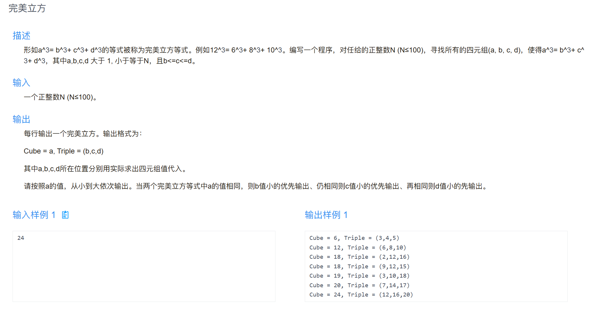

# 完美立方算法

> 枚举 + 剪枝，找 a³ = b³ + c³ + d³ 的所有解。

---



---

## 代码

```cpp
#include <iostream>
using namespace std;

int main() {
    int N;
    cin >> N;

    // 枚举 a
    for (int a = 2; a <= N; a++) {
        int a3 = a * a * a;
        // 枚举 b
        for (int b = 2; b < a; b++) {
            int b3 = b * b * b;
            // 枚举 c，保证 b <= c
            for (int c = b; c < a; c++) {
                int c3 = c * c * c;
                int d3 = a3 - b3 - c3;
                if (d3 < c * c * c) continue; // d < c 不满足 b<=c<=d
                // 枚举 d，保证 c <= d 且 d^3 == d3
                for (int d = c; d <= N; d++) {
                    if (d * d * d == d3) {
                        cout << "Cube = " << a
                             << ", Triple = (" << b << "," << c << "," << d << ")"
                             << endl;
                        break;
                    }
                    if (d * d * d > d3) break;
                }
            }
        }
    }
    return 0;
}
```

---

## 思路

- 四重循环枚举 a, b, c, d
- 约束 `b ≤ c ≤ d` 避免重复解
- 提前 `break` / `continue` 剪枝加速
